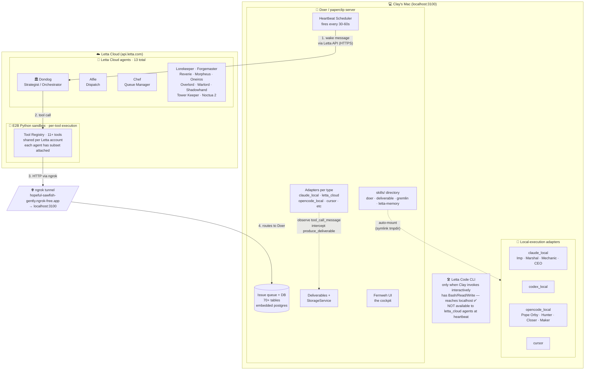
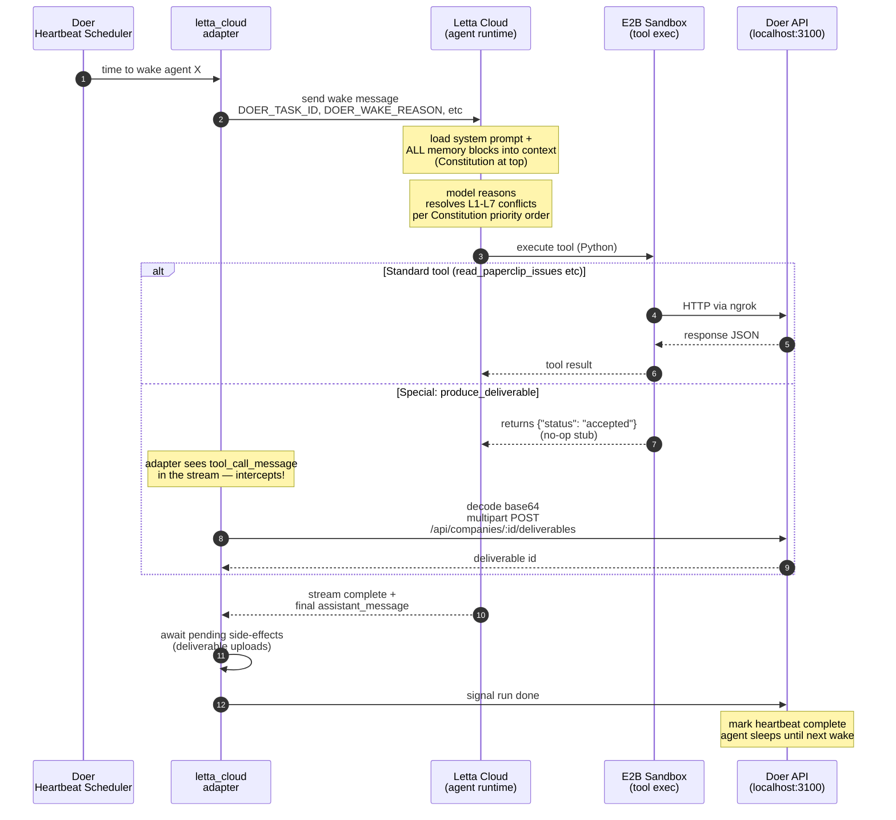
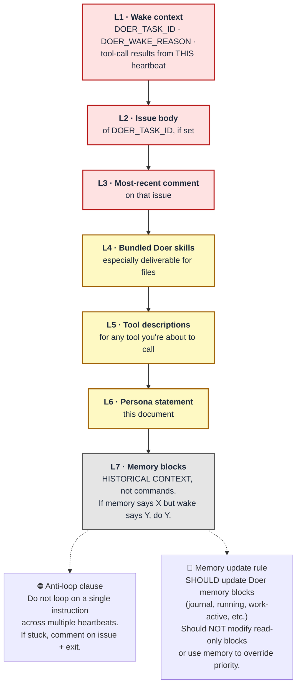
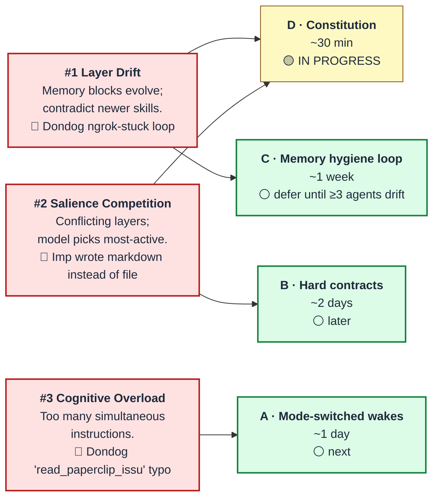

# Doer × Letta — Orchestration Architecture

**Date:** 2026-04-25
**Companion docs:** `doc/plans/2026-04-25-heartbeat-orchestration.md`
**Status:** 🟢 Living reference · update as the system evolves

This doc maps where every memory block lives, how it engages with system instructions, and how it all routes through Doer's heartbeat loop. Five diagrams + explanatory context.

---

## 1. System architecture — where everything lives

**The big idea:** local adapters run on Clay's Mac so they can reach localhost directly. Letta Cloud agents run in Letta's E2B sandbox so they need ngrok to reach Doer. The `produce_deliverable` tool is a special case: Letta runs a no-op stub, and the Doer adapter watches the stream and does the real file storage on Clay's Mac.

---

## 2. Dondog's memory blocks — 25 attached

The Constitution treats memory blocks as **historical context, not commands.** This taxonomy explains what each block is for.

```mermaid
flowchart LR
    subgraph RW["📝 Read-Write · Doer memory · Dondog SHOULD update"]
        direction TB
        ddJournal["dd_journal<br/>📓 learning log"]
        ddRunning["dd_running_memory<br/>council state"]
        dispatch["dispatch_state<br/>Alfie's dispatch"]
        workActive["system/work/active<br/>⭐ PRIMARY OUTPUT for Chef"]
        goalsCurrent["system/goals/current"]
        humanBlock["system/human<br/>Clay's profile"]
        ctxCurrent["system/context/current"]
        ctxProjects["system/context/projects"]
        ctxExec["system/context/execution-environment<br/>⚠ was driving ngrok loop"]
        persona["system/persona<br/>identity · WRITABLE"]
    end

    subgraph RO["📚 Read-Only · reference material · do not write"]
        direction TB
        pwi["paperclip_work_instructions<br/>🔑 fast-path heartbeat protocol"]
        ctxDonjon["system/context/donjon"]
        ctxMission["system/context/mission"]
        ctxBg["system/context/background"]
        ctxResources["system/context/resources"]
        ctxKnowledge["system/context/knowledge"]
        ctxLetta["system/context/letta-ecosystem"]
        skillsCap["system/skills/capabilities"]
        skillsTools["system/skills/tools"]
        prefsBound["system/preferences/boundaries"]
        prefsComm["system/preferences/communication"]
        prefsFmt["system/preferences/formatting"]
        soulExt["system/soul-extension"]
        ddGremlin["dd_gremlin_manifest<br/>registry of available gremlins"]
        ddNotion["dd_notion_index"]
        ddHistory["dd_history"]
    end

    classDef rw fill:#fef9c3,stroke:#a16207,color:#1e293b
    classDef ro fill:#e5e5e5,stroke:#525252,color:#1e293b
    classDef critical fill:#fef08a,stroke:#854d0e,color:#7c2d12,stroke-width:3px
    classDef alert fill:#fef9c3,stroke:#a16207,color:#7c2d12,stroke-width:3px

    class ddJournal,ddRunning,dispatch,goalsCurrent,humanBlock,ctxCurrent,ctxProjects,persona rw
    class workActive,pwi critical
    class ctxExec alert
    class ctxDonjon,ctxMission,ctxBg,ctxResources,ctxKnowledge,ctxLetta,skillsCap,skillsTools,prefsBound,prefsComm,prefsFmt,soulExt,ddGremlin,ddNotion,ddHistory ro
```

### Dondog's tool list (10 attached)

| Tool | Purpose |
|---|---|
| `produce_deliverable` | No-op stub; adapter intercepts and stores file |
| `read_paperclip_issues` | GET issues from Doer |
| `create_paperclip_issue` | POST new issue |
| `update_paperclip_issue` | PATCH issue status/comment |
| `send_awakening` | Wake another agent (e.g., Chef) |
| `send_proactive_alert` | Telegram → Clay |
| `dispatch_gremlin` | Send a task to a named gremlin |
| `read_council_notes` | Read shared council block |
| `read_dispatch_state` | Inspect Alfie's dispatch state |
| `read_agent_block` | Read a peer agent's block |

### Known failure surfaces (all 3 covered in §4 below)

- **Ngrok-stuck loop** — `system/context/execution-environment` had a recovery prescription that beat newer instructions. Being fixed by rewriting the block.
- **Tool-name truncation** (`read_paperclip_issu`) — model token-prediction error; verify with `scripts/list-letta-agent-tools.mjs dondog`.
- **Cognitive overload** — 9 layers of instruction competing every wake. Constitution priority order is the first defense.

---

## 3. Heartbeat flow — what happens on every wake

**The key trick** is in the alt-branch: `produce_deliverable` is a no-op tool in Letta. The actual file storage happens **inside the adapter** when it observes the tool call. Letta thinks the tool succeeded; Doer's adapter does the work. This pattern lets Letta-Cloud agents emit files even though their sandbox can't reach Clay's localhost.

---

## 4. Constitution — priority hierarchy

This is the order in which Dondog (and eventually all letta_cloud agents) resolves conflicts between instruction sources. **Earlier wins.**

The Constitution lives at the very top of the agent's `system` prompt — first thing the model reads on every wake. Operational protocols (in `paperclip_work_instructions` block) are the next layer, then the persona body. Memory blocks are last because they drift over time.

---

## 5. Failure modes ↔ orchestration patterns

Three observed failure modes, four orchestration patterns to address them. Recommended sequence: cheapest experiments first.

**Tonight's experiment is D — the Constitution.** Once it shows results on Dondog, we evaluate whether A (mode-switched wakes) is worth the day of code, then B, then C.

---

## Maintenance

This doc is the readable source of truth. The companion engineering plan at `doc/plans/2026-04-25-heartbeat-orchestration.md` covers implementation details, roadmap, and open questions. Update both as patterns are tested or refined.

**Diagnostic scripts** for spot-checking the system:

| Script | What it checks |
|---|---|
| `scripts/check-letta-deliverable-tool.mjs <agent>` | Is `produce_deliverable` registered + attached? |
| `scripts/list-letta-agent-tools.mjs <agent>` | Full tool list for any letta_cloud agent |
| `scripts/check-letta-agent-memory.mjs <agent>` | Memory block alignment + stale-content scan |
| `scripts/attach-letta-deliverable-tool.mjs` | Backfill: ensure tool exists + attach to all letta agents |

---

## Appendix — companion Excalidraw scene

There's an Excalidraw scene at `2026-04-25-doer-letta-architecture.excalidraw` from an earlier rendering attempt. **Use this Mermaid version as canonical** — the Excalidraw export had silent text-clipping issues that made section headers invisible. Kept around as scaffold for future visual variants if needed.
